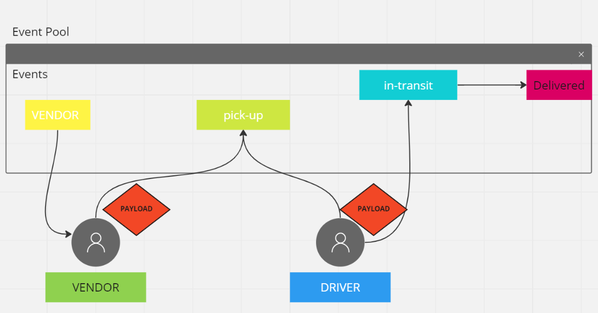

# CAPS

# Project: CAPS

## Author: Rafael Aldana

### Problem Domain

 CAPS simulates a delivery service where vendors (such a flower shops) will ship products using our delivery service and when our drivers deliver them, each vendor will be notified that their customers received what they purchased.

### Links and Resources

- [Github](https://github.com/Rafael-Aldana/CAPS)

### Setup

#### .env requirements (where applicable)
N/A

#### How to initialize/run your application (where applicable)

- node hub.js

#### Tests

Write unit tests for each event handler function (not event triggers themselves).
Use spies to help testing your logger methods (assert that console.log was called right).

.
Collaborated with Jordan Convington.